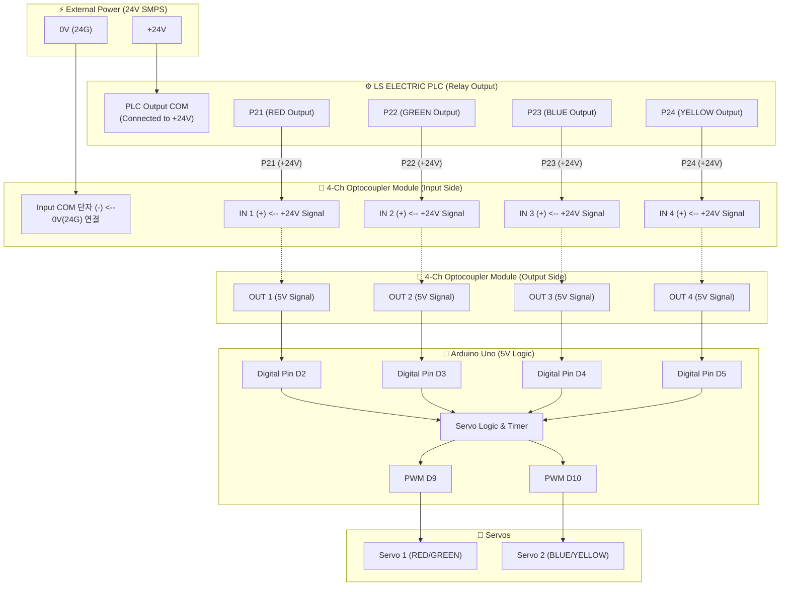
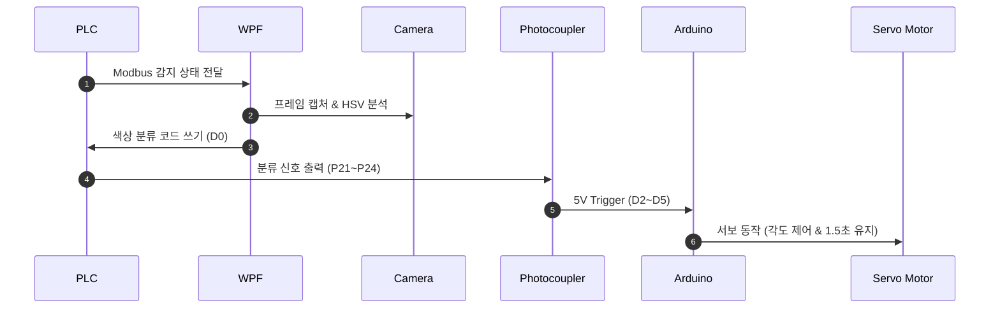

# Vision & Modbus PLC 기반 스마트 컬러 분류 시스템

WPF 대시보드 UI를 통한 비전 모니터링, Modbus RTU PLC 통신 제어, 데이터베이스 이력 관리 및 아두이노 서보모터 분류 제어 통합 스마트 팩토리 프로젝트입니다.

---
### 📌 바로가기 
- [1. 시스템 개요](#1-시스템-개요)
- [2. 기술 스택](#2-기술-스택-tech-stack)
- [3. 주요 기능](#3-주요-기능-key-features)
- [4. 하드웨어 결선 다이어그램](#4-하드웨어-결선-다이어그램)
- [5. 시퀀스 다이어그램](#5-시퀀스-다이어그램)
- [6. 실행 및 구축 가이드](#6-실행-및-구축-가이드)

> 📂 **파트별 세부 매뉴얼 (Quick Links)**
> - [**C# WPF**](./src) (MVVM 구조, 비전 처리, DB 연동)
> - [**LS ELECTRIC PLC**](./plc) (Modbus I/O 맵, XG5000 래더)
> - [**아두이노 서보모터**](./firmware) (포토커플러 회로, 서보 핀 맵)
> - [**DB MSSQL**](./sql) (SQL 스크립트, DB ERD)
---

## 1. 시스템 개요
본 시스템은 컨베이어 벨트를 통해 이송되는 물품의 색상을 **카메라**로 실시간 감지하고, **Modbus RTU 통신**을 통해 **LS ELECTRIC PLC** 및 **Arduino 서보모터**를 제어하여 색상별로 자동 분류하는 종합 스마트 제어 시스템입니다.
## 2. 기술 스택 (Tech Stack) 
### Software & Framework 
- **Language**: C# (.NET 10.0) 
- **UI Framework**: WPF (MVVM Pattern) 
- **Vision**: OpenCV, CvSharp4 
- **Database**: MSSQL 
- **Firmware**: Arduino IDE (C/C++) 
- **PLC**: LS ELECTRIC XGT PLC (XG5000) 
- **Actuator**: SG90 / MG996R Servo Motors 
- **Protocol**: Modbus RTU (RS-485 Serial) 
- **Interface**: 24V-5V Optocoupler Module 
## 3. 주요 기능 (Key Features) 
### 1️⃣ 운전 모드 관리 (Operation Modes) 
- **Auto (자동 모드)**: AI 비전 카메라가 색상(RED, GREEN, BLUE, YELLOW)을 실시간 판별하여 PLC 접점 명령(P21~P24)을 자동으로 전송합니다. 
- **Manual (수동 모드)**: 수동 제어 패널이 활성화되어 각 색상별 분류 동작을 개별 테스트할 수 있습니다. (Auto/Simulation 모드 시 비활성화 차단 처리) 
- **Simulation (시뮬레이션)**: 가상 데이터 타이머를 통해 실물 장비 연결 없이 전체 분류 시나리오를 테스트합니다. 
### 2️⃣ 실시간 모니터링 & 수량 집계 
- RED / GREEN / BLUE / YELLOW 및 TOTAL 실시간 분류 수량 카운팅 
- PLC Modbus 통신 상태 및 USB 비전 카메라 연결 상태 실시간 표시 
### 3️⃣ 데이터베이스 관리 & CSV 내보내기 (Data Analytics) 
- 모든 분류 이벤트(일시, 운전모드, 색상, 서보각도, 상세 메시지) 실시간 DB(MSSQL) 저장 
- 기간별 / 운전모드별 / 색상별 필터링 조건 검색 지원 
- UTF-8 (BOM) 포맷 **CSV 파일 엑셀 내보내기** 지원 (한글 깨짐 방지)
---
## 4. 하드웨어 결선 다이어그램

---
## 5. 시퀀스 다이어그램

---
## 6. 실행 및 구축 가이드 
### 1️⃣ C# WPF 실행 
1. `src/SmartSorter.sln` 솔루션 파일을 Visual Studio 2022 이상에서 열기. 
2. `Services/DatabaseService.cs` 소스코드 내 MSSQL 접속 문자열(`_connectionString`)을 DB 환경(Server IP, DB명, 계정 정보)에 맞게 수정.
3. NuGet 패키지 복원 후 빌드 및 실행.
### 2️⃣ MSSQL 데이터베이스 구축 
1. SQL Server Management Studio (SSMS) 실행 및 MSSQL 서버 접속 
2. `sql/schema.sql` 스크립트 실행하여 `SmartSorter` 데이터베이스 및 테이블, 인덱스 생성.
### 3️⃣ PLC 프로그램 전송 
1. XG5000 프로그램 실행 후 plc/SmartSorter_PLC.xgp 프로젝트를 열기. 
2. PLC 연결 후 래더 프로그램 쓰기(다운로드). 
### 4️⃣ 아두이노 업로드 
1. firmware/SmartSorter_Arduino/SmartSorter_Arduino.ino 파일을 아두이노 IDE에서 열기. 
2. 아두이노 우노(UNO) 보드에 스케치를 업로드.
