# Arduino Firmware

LS ELECTRIC PLC의 24V 디지털 출력 신호(P21~P24)를 포토커플러 모듈을 통해 수신하여 2개의 서보모터(SG90/MG996R) 각도를 제어하는 아두이노 스케치입니다.

---

## 1. 핀 맵 (Pin Mapping)

### 디지털 입력 (from 24V-5V Optocoupler)
PLC의 24V 출력이 포토커플러 모듈을 거쳐 5V TTL 신호로 아두이노 핀에 입력됩니다.

| 아두이노 핀 | PLC 접점 | 감지 색상 | 비고 |
| :---: | :---: | :---: | :--- |
| **`D2`** | `P21` | **RED** | 포토커플러 OUT 1 |
| **`D3`** | `P22` | **GREEN** | 포토커플러 OUT 2 |
| **`D4`** | `P23` | **BLUE** | 포토커플러 OUT 3 |
| **`D5`** | `P24` | **YELLOW** | 포토커플러 OUT 4 |

### PWM 출력 (to Servo Motors)
| 아두이노 핀 | 모터 구분 | 제어 항목 |
| :---: | :---: | :--- |
| **`D9`** | **Servo 1** | RED / GREEN 분류용 |
| **`D10`** | **Servo 2** | BLUE / YELLOW 분류용 |

---

## 2. 배선 다이어그램

```mermaid
graph TD
    %% ==========================================
    %% 1. 전원 공급부 (HW-131 & Breadboard Rails)
    %% ==========================================
    subgraph POWER["[전원 공급부] HW-131 및 빵판 레일"]
        direction TB
        HW131["<b>HW-131 전원모듈</b><br/>• DC-IN Jack (어댑터)<br/>• Switch (전원버튼)<br/>• Jumper Caps (5V 설정)"]
        
        BB_TOP["<b>빵판 상단 전원 레일</b><br/>• TOP (+) [5V]<br/>• TOP (-) [GND]"]
        BB_BOT["<b>빵판 하단 전원 레일</b><br/>• BOT (+) [5V]<br/>• BOT (-) [GND]"]

        HW131 -->|Pin Header 꽂힘| BB_TOP
        HW131 -->|Pin Header 꽂힘| BB_BOT
        BB_TOP == "점퍼선 연결 (+5V / GND)" ==> BB_BOT
    end

    %% ==========================================
    %% 2. 포토커플러 모듈 (PC817 4채널)
    %% ==========================================
    subgraph PCU["[포토커플러 모듈] 4-Channel PC817"]
        direction TB
        subgraph PCU_IN_SIDE["입력 단자대 (24V High-Voltage Area)"]
            IN1["IN1 (RED)"]
            IN2["IN2 (GREEN)"]
            IN3["IN3 (BLUE)"]
            IN4["IN4 (YELLOW)"]
            COM["COM (PLC Common)"]
        end

        subgraph PCU_OUT_SIDE["출력 핀헤더 (5V Logic Area)"]
            PCU_VCC["VCC (+5V)"]
            PCU_GND["GND (0V)"]
            OUT1["OUT1"]
            OUT2["OUT2"]
            OUT3["OUT3"]
            OUT4["OUT4"]
        end
    end

    %% ==========================================
    %% 3. PLC 및 외부 신호
    %% ==========================================
    subgraph PLC_SYS["[PLC 시스템] 24V 신호"]
        PLC_P21["P21 (RED 출력)"]
        PLC_P22["P22 (GREEN 출력)"]
        PLC_P23["P23 (BLUE 출력)"]
        PLC_P24["P24 (YELLOW 출력)"]
        PLC_24G["24G (PLC SMPS -)"]
    end

    %% ==========================================
    %% 4. 아두이노 우노 (Arduino Uno)
    %% ==========================================
    subgraph UNO["[메인 제어기] Arduino Uno R3"]
        direction TB
        subgraph UNO_DIGITAL["Digital I/O Pins"]
            D2["Pin 2 (Digital IN)"]
            D3["Pin 3 (Digital IN)"]
            D4["Pin 4 (Digital IN)"]
            D5["Pin 5 (Digital IN)"]
            D9["Pin 9 (PWM OUT)"]
            D10["Pin 10 (PWM OUT)"]
        end
        
        subgraph UNO_POWER["Power Pins"]
            UNO_GND["GND (Common Ground)"]
        end
    end

    %% ==========================================
    %% 5. 서보모터 구동부 (MG90S)
    %% ==========================================
    subgraph SERVOS["[구동부] MG90S 서보모터"]
        subgraph SV_RED["RED 서보모터"]
            SV1_VCC["VCC 단자 (빨강)"]
            SV1_GND["GND 단자 (갈색)"]
            SV1_SIG["PWM Signal (주황)"]
        end

        subgraph SV_GRN["GREEN 서보모터"]
            SV2_VCC["VCC 단자 (빨강)"]
            SV2_GND["GND 단자 (갈색)"]
            SV2_SIG["PWM Signal (주황)"]
        end
    end

    %% ==========================================
    %% 배선 연결 관계 (Connections)
    %% ==========================================

    %% 1) PLC -> 포토커플러 입력 단자
    PLC_P21 -->|24V Signal| IN1
    PLC_P22 -->|24V Signal| IN2
    PLC_P23 -->|24V Signal| IN3
    PLC_P24 -->|24V Signal| IN4
    PLC_24G -->|0V Common| COM

    %% 2) 빵판 전원 -> 포토커플러 출력측 전원
    BB_TOP -->|+5V| PCU_VCC
    BB_TOP -->|GND| PCU_GND

    %% 3) 포토커플러 출력 단자 -> 아두이노 입력 핀
    OUT1 -->|Pulse Signal| D2
    OUT2 -->|Pulse Signal| D3
    OUT3 -->|Pulse Signal| D4
    OUT4 -->|Pulse Signal| D5

    %% 4) 빵판 전원 -> 아두이노 공통 접지 (Common GND)
    BB_TOP -.->|GND 점퍼선| UNO_GND

    %% 5) 빵판 전원 -> 서보모터 전원 단자
    BB_BOT -->|+5V| SV1_VCC
    BB_BOT -->|GND| SV1_GND
    BB_BOT -->|+5V| SV2_VCC
    BB_BOT -->|GND| SV2_GND

    %% 6) 아두이노 PWM 핀 -> 서보모터 신호 단자
    D9 -->|PWM Control| SV1_SIG
    D10 -->|PWM Control| SV2_SIG

    %% ==========================================
    %% 스타일 지정
    %% ==========================================
    classDef pwrStyle fill:#ffebee,stroke:#c62828,stroke-width:2px;
    classDef plcStyle fill:#e3f2fd,stroke:#1565c0,stroke-width:2px;
    classDef pcuStyle fill:#fff3e0,stroke:#ef6c00,stroke-width:2px;
    classDef unoStyle fill:#e8f5e9,stroke:#2e7d32,stroke-width:2px;
    classDef svStyle fill:#f3e5f5,stroke:#7b1fa2,stroke-width:2px;

    class HW131,BB_TOP,BB_BOT pwrStyle;
    class PLC_P21,PLC_P22,PLC_P23,PLC_P24,PLC_24G plcStyle;
    class PCU_VCC,PCU_GND,IN1,IN2,IN3,IN4,COM,OUT1,OUT2,OUT3,OUT4 pcuStyle;
    class D2,D3,D4,D5,D9,D10,UNO_GND unoStyle;
    class SV1_VCC,SV1_GND,SV1_SIG,SV2_VCC,SV2_GND,SV2_SIG svStyle;
```

---

## 3. 주요 구현 로직

1. **포토커플러 절연 입력**: PLC의 24V 고전압 노이즈가 아두이노에 직접 유입되는 것을 방지하기 위해 4채널 24V-5V 포토커플러 모듈을 사용.
2. **이중 서보 독립 제어**: 분류 가이드 라인에 따라 Servo 1(RED/GREEN)과 Servo 2(BLUE/YELLOW)를 구분하여 정밀 제어.
3. **타임 홀드 및 자동 원점 복귀**: 신호 수신 즉시 지정된 각도로 서보를 구동하고, 분류 동작 유지를 위해 1.5초간 유지한 뒤 원점(`0°`)으로 자동 대기 복귀.

---

## ⚠️ 회로 작성 시 주의사항

- **전원 분리 필수**: 서보모터 2개 구동 시 순간 전류 소모가 크므로, 아두이노의 5V 핀에 직접 연결하지 말고 **외부 5V SMPS/전원 공급장치**를 사용. (아두이노 GND와 5V SMPS GND는 공통 접지 필수)
- **포토커플러 신호극성**: PLC 출력 방식(NPN Sink / PNP Source)에 맞게 포토커플러 입력 배선이 올바르게 되어 있는지 확인 후 접속.

---
