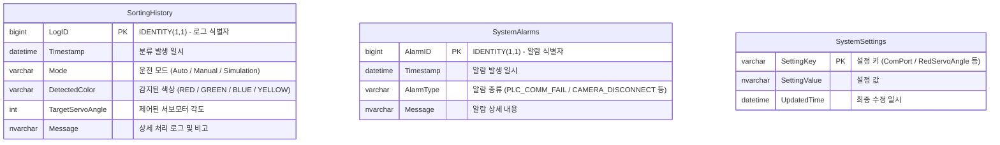

# Database Architecture & Schema Spec

SmartSorter 시스템의 데이터 수집, 시스템 설정 및 알람 이력을 관리하기 위한 **MSSQL (SQL Server)** 데이터베이스 구조 문서입니다.

---

## 1. 데이터베이스 ERD (Entity Relationship Diagram)

---

## 2. 테이블 스키마 상세 (Table Specifications)

### 1️⃣ `SortingHistory` (분류 이력 테이블)
비전 카메라 및 PLC 연동을 통해 물품이 분류될 때마다 실시간으로 기록되는 테이블입니다.

| 컬럼명 (Column) | 데이터 타입 (Data Type) | 제약 조건 (Constraints) | 설명 (Description) |
| :--- | :--- | :--- | :--- |
| **`LogID`** | `BIGINT` | `PK`, `IDENTITY(1,1)` | 분류 로그 고유 번호 (자동 증가) |
| **`Timestamp`** | `DATETIME` | `NOT NULL` | 물품 분류 처리 시각 |
| **`Mode`** | `VARCHAR(20)` | `NOT NULL` | 운전 모드 (`Auto`, `Manual`, `Simulation`) |
| **`DetectedColor`** | `VARCHAR(20)` | `NOT NULL` | 인식된 색상 (`RED`, `GREEN`, `BLUE`, `YELLOW`) |
| **`TargetServoAngle`**| `INT` | `NOT NULL` | 구동된 서보모터 목표 각도 (30°, 120° 등) |
| **`Message`** | `NVARCHAR(255)`| `NULL` | 동작 상태 및 통신 응답 상세 메시지 |

> **인덱스 설정**: 기간별 조회 및 대용량 로그 검색 속도 향상을 위해 `Timestamp` 컬럼에 비클러스터형 인덱스(`IX_SortingHistory_Timestamp`)가 생성되어 있습니다.

---

### 2️⃣ `SystemSettings` (시스템 설정 테이블)
C# WPF 대시보드 애플리케이션의 시리얼 통신 포트, 비전 ROI 영역, 서보모터 제어 각도 등의 환경설정 값을 저장합니다.

| 컬럼명 (Column) | 데이터 타입 (Data Type) | 제약 조건 (Constraints) | 설명 (Description) |
| :--- | :--- | :--- | :--- |
| **`SettingKey`** | `VARCHAR(50)` | `PK`, `NOT NULL` | 설정 항목 식별 키 |
| **`SettingValue`** | `NVARCHAR(255)`| `NOT NULL` | 설정 항목 값 |
| **`UpdatedTime`** | `DATETIME` | `DEFAULT (GETDATE())` | 설정 수정 일시 |

#### 주요 초기 설정 값 (`schema.sql` 자동 등록 항목)
- **통신 설정**: `ComPort` (`COM9`), `BaudRate` (`9600`), `StationId` (`1`)
- **서보 각도**: `RedServoAngle` (`45`), `GreenServoAngle` (`90`), `BlueServoAngle` (`135`), `YellowServoAngle` (`180`)
- **비전 ROI**: `CameraSource` (`0`), `DetectionIntervalMs` (`1000`), `RoiWidth` (`120`), `RoiHeight` (`120`), `RoiOffsetX` (`0`), `RoiOffsetY` (`0`)

---

### 3️⃣ `SystemAlarms` (시스템 알람 및 오류 이력)
PLC 통신 단선, 비전 카메라 해제 등 장비 운용 중 발생하는 이벤트 및 알람 이력을 기록합니다.

| 컬럼명 (Column) | 데이터 타입 (Data Type) | 제약 조건 (Constraints) | 설명 (Description) |
| :--- | :--- | :--- | :--- |
| **`AlarmID`** | `BIGINT` | `PK`, `IDENTITY(1,1)` | 알람 고유 번호 (자동 증가) |
| **`Timestamp`** | `DATETIME` | `DEFAULT (GETDATE())` | 알람 발생 시각 |
| **`AlarmType`** | `VARCHAR(50)` | `NOT NULL` | 알람 유형 식별자 |
| **`Message`** | `NVARCHAR(255)`| `NOT NULL` | 알람 상세 내용 |

---

