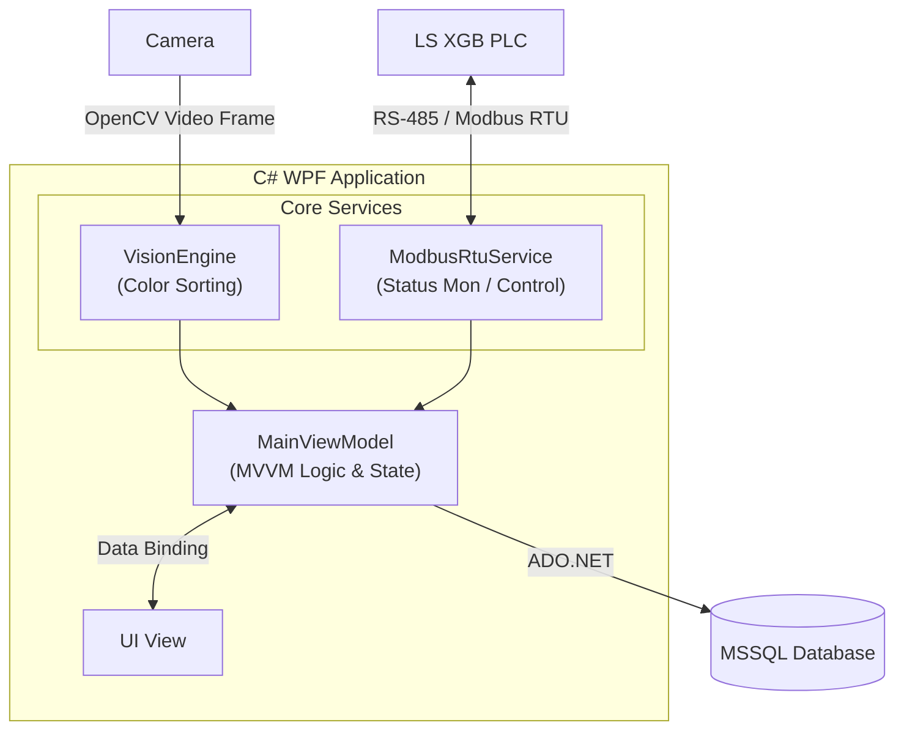

# SmartSorter C# WPF 사양 문서입니다.  
OpenCV(Emgu CV)를 이용한 실시간 비전 인식, PLC와의 Modbus RTU 통신, MSSQL 데이터베이스 연동 및 MVVM 아키텍처 구조를 설명합니다.

---

## 1. 시스템 아키텍처 개요

본 애플리케이션은 **MVVM (Model-View-ViewModel)** 패턴으로 설계되었으며, 비전 영상 처리, 통신 스레드, 데이터베이스 입출력이 독립된 레이어로 분리되어 동작합니다.


---

## 2. 프로그램 화면 사진 설명

### 1️⃣ 카메라
- 
- **카메라연결 및 설정**: 카메라 연결 및 바운딩 박스 & 인식간격 조절 .
- **실시간 카메라 모니터링** : 카메라를 통한 객체 판별 및 바운딩 박스 영역 실시간 프리뷰

### 2️⃣ 제어 & 모니터링
- 
- **PLC 연결** : PLC연결 및 해지.
- **공정 운전 상태 모니터링** : 
    - 작동 / 대기 / 비상정지 램프 표시
    - 통신 상태 모니터링
    - 공정 운전 상태 
- **수동 공정 제어** :
  - 컨베이어 모터 구동/정지 테스트
  - 분류별 포토커플러 신호 펄스 강제 출력 테스트
  - 아두이노 서보모터 원점 복귀 및 각도 제어 신호 테스트

### 3️⃣ 데이터
- 
- **분류 이력 조회(History View)** : 날짜/시간, 색상 종류, 분류 판별 결과, 처리 시간 데이터 조회
- **데이터 엑스포트(Export)** : 조회된 공정 이력 데이터를 CSV로 저장 및 이력 출력 기능


### 4️⃣ 환경 설정
- 
- **PLC 통신 파라미터 세팅** : COM, 국번, 통신주기 설정
- **서보모터 동작 제어값** :  색상별 서보모터 구동 각도(Angle) 및 유지 시간(Pulse Delay) 세팅
---

## 3. 주요 기능 및 모듈 구성

### 1️⃣ UI & MVVM (View / ViewModel)
- **MainWindow.xaml**: 카메라 실시간 프레임, ROI 설정 박스, PLC 통신 상태, 분류 카운터 및 로그 리스트를 보여주는 메인 대시보드.
- **MainViewModel.cs**: Reactive UI 데이터 바인딩, Command 처리, 주기적 상태 갱신 타이머 관리.

### 2️⃣ 비전 인식 엔진 (`Services/VisionEngine.cs`)
- **OpenCV (Emgu CV / OpenCvSharp)** 기반 프레임 캡처 및 HSV 색상 공간 변환.
- 지정된 **ROI( 관심 영역 )** 내부의 픽셀 분포 분석을 통해 `RED`, `GREEN`, `BLUE`, `YELLOW` 색상 실시간 분류.
- 노이즈 제거(Gaussian Blur, Morphological Operations) 및 임계값(Threshold) 처리.

### 3️⃣ PLC 통신 모듈 (`Services/ModbusRtuService.cs`)
- `System.IO.Ports.SerialPort` 기반 Modbus RTU 마스터 프로토콜 구현.
- **주요 레지스터 제어**:
  - `M0000` (Coil 00001): 원격 가동 시작 명령
  - `P0003` (Discrete Input 10001): 감지 센서 상태 폴링
  - `D0000` (Holding Reg 40001): 분류 색상 코드 전달 ($1=	ext{RED}$, $2=	ext{GREEN}$, $3=	ext{BLUE}$, $4=	ext{YELLOW}$)

### 4️⃣ 데이터베이스 연동 (`Repositories/DatabaseRepository.cs`)
- **MSSQL (`SmartSorterDB`)** 연동.
- 분류 발생 시 `SortingHistory` 테이블에 비동기(`async/await`) 로그 저장.
- 시리얼 포트 번호, ROI 위치 정보 등의 환경설정을 `SystemSettings` 테이블에서 로드 및 저장.

---

## 4. 프로젝트 폴더 구조

```text
src/SmartSorter.Wpf/
├── App.xaml / App.xaml.cs
│   └── 앱 진입점 및 전역 리소스 정의
├── MainWindow.xaml
│   └── 메인 쉘(Shell) 윈도우 UI
├── Views/
│   ├── ControlPanelView.xaml   # 메인 제어 및 실시간 모니터링
│   ├── HistoryView.xaml        # 이력 데이터 및 통계 화면
│   └── SettingsView.xaml       # 통신 및 비전 환경설정 화면
├── ViewModels/
│   └── MainViewModel.cs        # 메인 데이터 컨텍스트 및 중앙 제어기
├── Models/
│   ├── PlcConfigModel.cs       # PLC 및 하드웨어 통신 설정 모델
│   ├── SortingLog.cs           # 분류 이력 단품 데이터 모델
│   └── SystemEnum.cs           # 시스템 전역 열거형(Enum) 정의
├── Services/
│   ├── CameraService.cs        # OpenCV 기반 카메라 및 비전 검출
│   ├── DatabaseService.cs      # DB CRUD 및 이력 관리 서비스
│   ├── PlcService.cs           # PLC 통신 드라이버 및 I/O 동기화
│   ├── SimulationService.cs    # 실물 장비 부재 시 테스트용 시뮬레이터
│   └── StringToVisibillityConverter.cs
└── Converters/
    └── EqualToVisibillityConverter.cs
```

---
